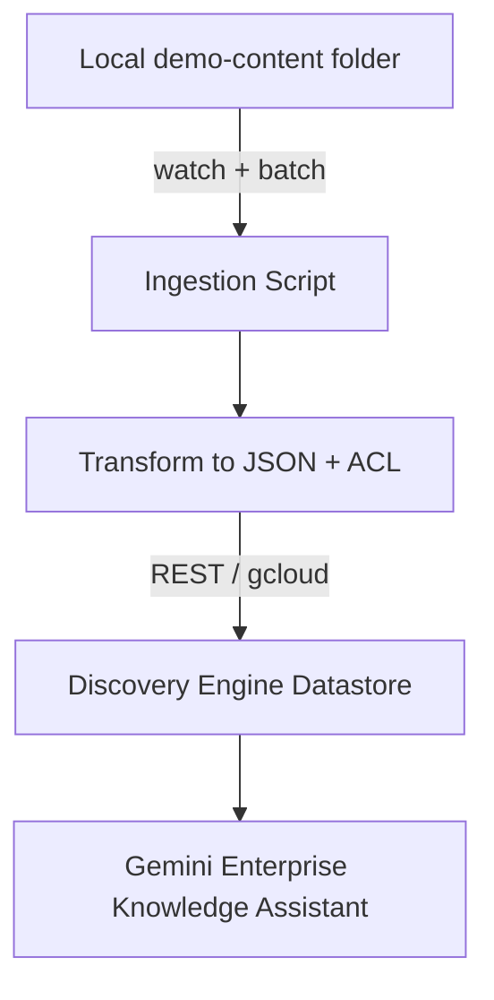

# Custom Connector MVP Checklist

## Goals & Success Criteria
- [ ] Deliver a runnable demo that shows how Gemini Enterprise (Agentspace) can index and secure a previously unsupported knowledge source using a custom connector.
- [ ] Keep the scenario lightweight enough for a workshop: single laptop, one GCP project (`sascha-playground-doit`), no external system dependencies.
- [ ] Demonstrate end-to-end data sync, incremental updates, and permissions-aware search within the native Gemini Enterprise interface (no custom React UI).

## High-Level Delivery Steps
- [x] Finalize the demo use case and sample content.
- [x] Prepare the GCP project and enable required services.
- [x] Build the ingestion pipeline (bootstrap datastore, transform documents, import).
- [x] Layer in real-time change detection and re-ingestion.
- [ ] Model and validate permissions for “view as user” scenarios with `sascha@doit.com` and `another-user@doit.com`.
- [ ] Register the connector with Gemini Enterprise and rehearse the workshop flow.

## Recommended Demo Use Cases
- [x] Curate **static handbooks** (Markdown/PDF) representing an internal “Launch Operations Handbook” to highlight chunking.
- [x] Prepare an **FAQ spreadsheet** (CSV/Sheets export) to demonstrate schema transformation into Discovery Engine documents.
- [x] Gather **runbook snippets** (plain-text `.txt`) to show incremental updates and ACL differences per file.
- [x] Store all artefacts under `custom-connector/demo-content/` with metadata (owner, confidentiality) for search filters and ACLs.

## Architecture Overview
- [x] Maintain local `demo-content/` folder in Git for all sample files.
- [x] Implement a batch ingestion script plus a `watchfiles` watcher for real-time demos.
- [x] Transform files into Discovery Engine `Document` JSON (title, content, metadata, ACL bindings).
- [x] Transport payloads via Discovery Engine `import_documents` with chunking enabled.
- [x] Target datastore resource: `projects/sascha-playground-doit/locations/global/collections/default_collection/dataStores/demo_local_docs_acl_v1`.
- [ ] Leverage Gemini Enterprise UI as the “view as user” surface—no custom React UI needed.



## Environment & Project Setup
- [x] Sign in with workshop credentials and set project: `gcloud config set project sascha-playground-doit`.
- [x] Enable APIs: `discoveryengine.googleapis.com`, `aiplatform.googleapis.com`, `cloudfunctions.googleapis.com`, `run.googleapis.com` (for optional Cloud Run packaging).
- [x] Create service account `agentspace-connector@sascha-playground-doit.iam.gserviceaccount.com`.
  - [x] Grant `roles/discoveryengine.admin`.
  - [x] Grant `roles/storage.objectViewer` (future GCS support).
  - [x] Grant `roles/iam.serviceAccountTokenCreator` (if impersonation is required).
- [x] Capture short-lived user tokens for curl demos with `gcloud auth application-default print-access-token`.

## Stage 1 – Datastore Bootstrap
- [x] Choose datastore ID `demo_local_docs_acl_v1` (original `demo_local_docs_v1` retained only as a non-ACL fallback).
- [x] Create datastore with ACL + chunking enabled (Python helper snippet):
  ```bash
  python - <<'PY'
  from google.cloud import discoveryengine_v1alpha as de
  project='sascha-playground-doit'
  location='global'
  parent=de.DataStoreServiceClient().collection_path(project, location, 'default_collection')
  chunk=de.DocumentProcessingConfig.ChunkingConfig(
      layout_based_chunking_config=de.DocumentProcessingConfig.ChunkingConfig.LayoutBasedChunkingConfig(
          chunk_size=400,
          include_ancestor_headings=True,
      )
  )
  parsing=de.DocumentProcessingConfig.ParsingConfig(
      layout_parsing_config=de.DocumentProcessingConfig.ParsingConfig.LayoutParsingConfig()
  )
  request=de.CreateDataStoreRequest(
      parent=parent,
      data_store_id='demo_local_docs_acl_v1',
      data_store=de.DataStore(
          display_name='Demo Local Docs ACL',
          industry_vertical=de.IndustryVertical.GENERIC,
          solution_types=[de.SolutionType.SOLUTION_TYPE_SEARCH],
          content_config=de.DataStore.ContentConfig.CONTENT_REQUIRED,
          acl_enabled=True,
          document_processing_config=de.DocumentProcessingConfig(
              chunking_config=chunk,
              default_parsing_config=parsing,
          ),
      ),
  )
  de.DataStoreServiceClient().create_data_store(request=request).result()
  PY
  ```
- [x] Record datastore resource name `projects/sascha-playground-doit/locations/global/collections/default_collection/dataStores/demo_local_docs_acl_v1`.

## Stage 2 – Content Modeling
- [x] Normalize each file into schema fields (`id`, `content`, `structData`, `aclInfo`).
- [x] Ensure `structData` captures `sourceType`, `lastModified`, `tags`, `owners`.
- [x] Populate `aclInfo.allowedPrincipals` with `user:sascha@doit.com` and/or `user:another-user@doit.com` per file; leave room for group-based ACLs.
- [x] Publish mapping table (`custom-connector/demo-content/catalog.json`) documenting metadata + access.
- [x] Add workshop talking points on how ACLs enable “view as user”.

Workshop talking points:
- Highlight how `catalog.json` mirrors `acl-mapping.yaml` so non-engineers can edit visibility safely.
- Demonstrate `tools/import_local_docs.py --dry-run` to show audience exactly which principals attach to each document before importing.
- Emphasize persona swap (`sascha@doit.com` vs. `another-user@doit.com`) and expectations for restricted runbooks in Gemini search.

## Stage 3 – Initial Import Script
- [x] Set up virtualenv and install `google-cloud-discoveryengine`, `google-cloud-storage`, `watchfiles`.
- [x] Implement `custom-connector/tools/import_local_docs.py` to:
  - [x] Parse `demo-content/` directory and derive metadata.
  - [x] Build batch `ImportDocumentsRequest` with inline source using deterministic IDs.
  - [x] Call `DocumentServiceClient.import_documents` with incremental reconciliation.
  - [x] Await the long-running operation and emit success/error counts.
- [x] Document CLI usage:
  ```bash
  python tools/import_local_docs.py \
    --project sascha-playground-doit \
    --location global \
    --data-store-id demo_local_docs_acl_v1 \
    --content-root ./demo-content
  ```
- [x] Validate import indirectly:
  - `scripts/smoke_search.sh` now targets `demo_local_docs_acl_v1`; it returns empty results when using a service account token (expected for ACL-protected stores).
  - Confirm via Gemini Enterprise UI using persona switching (``sascha@doit.com`` should see the runbook, ``another-user@doit.com`` should not).

## Stage 4 – Real-Time Ingestion Demo
- [x] Install watcher (`watchfiles`) to monitor `demo-content/`.
- [x] On filesystem change, rebuild the corresponding Document payload and call `import_documents` for just that file.
- [x] Provide `tools/watch_local_docs.py` for live demos (optional `--skip-acl` flag remains for local dry runs, but production demos run with ACLs active).
  ```bash
  python tools/watch_local_docs.py \
    --project sascha-playground-doit \
    --location global \
    --data-store-id demo_local_docs_acl_v1 \
    --content-root ./demo-content \
    --verbose
  ```
- [x] Rehearse workflow: run watcher, edit local file, observe CLI upsert log, verify in Gemini search.
- [x] Document optional dry-run flow using `tools/import_local_docs.py --dry-run`.

## Stage 5 – Permissions Walkthrough
- [x] Maintain `acl-mapping.yaml` mapping file paths to principals (`user:sascha@doit.com`, `user:another-user@doit.com`).
- [x] During import, populate `Document.aclInfo.allowedPrincipals` from mapping to scope visibility.
  - Imports now target `demo_local_docs_acl_v1`, which enforces ACLs via the configured identity provider.
- [ ] Demo as `sascha@doit.com` (access handbook + runbooks).
- [ ] Demo as `another-user@doit.com` (restricted to FAQ subset).
- [ ] Use Gemini Enterprise impersonation/“view as user” to showcase ACL impact.

## Integration With Gemini Enterprise
- [ ] Register datastore `demo_local_docs_acl_v1` as custom connector in Agentspace console (deprecate the earlier non-ACL store).
- [ ] Map demo personas (`sascha@doit.com`, `another-user@doit.com`) to Google identity groups consistent with `aclInfo` entries.
- [ ] Configure assistant workspace scoped only to `demo_local_docs_acl_v1` for clarity.
- [ ] Test queries including metadata filters (`filter { structData.sourceType = "faq" }`).

## Workshop Flow (Suggested 30–35 minutes)
- [ ] Prepare 5-minute intro on why custom connectors matter.
- [ ] Live-run bootstrap script, show datastore creation, review JSON payload (≈10 minutes).
- [ ] Demonstrate real-time update from local edit through Gemini search (≈5 minutes).
- [ ] Switch persona (`sascha@doit.com` → `another-user@doit.com`) to highlight permissions (≈5 minutes).
- [ ] Close with Q&A and roadmap (≈5 minutes).

## Validation & Troubleshooting Checklist
- [ ] Run `gcloud alpha discovery-engine data-stores list --project=sascha-playground-doit` to confirm resources.
- [ ] Inspect stuck imports with `gcloud alpha discovery-engine operations describe <operation-id>`.
- [ ] Verify chunking via `documents:getProcessedDocument` requests.
- [x] Maintain `scripts/smoke_search.sh` to POST sample query with `contentSearchSpec.searchResultMode="CHUNKS"`.
- [ ] Track import counts, errors, and ACL assignments in logs.

## Out of Scope (Future Enhancements)
- [ ] Note future connector targets (Confluence, ServiceNow) but exclude from MVP.
- [ ] Defer bi-directional sync or delete propagation policies.
- [ ] Skip custom front-end; rely exclusively on Gemini Enterprise UI.
- [ ] Postpone automated CI/CD packaging; use manual scripts for MVP.

## Next Steps After MVP Sign-Off
- [ ] Package ingestion script as Cloud Run Job for repeatability.
- [ ] Add Terraform modules for datastore + IAM management.
- [ ] Expand content taxonomy and add enrichment (entity extraction) prior to import.
